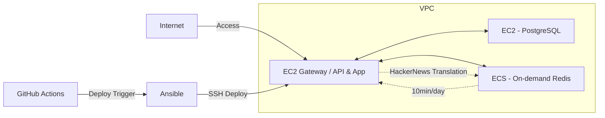

# Blog Project Overview

This project is a fully self-hosted, full-stack web application for blogging, built and maintained by myself.
It automates the collection, summarization, translation, and publishing of Hacker News articles using a combination of Playwright, OpenAI APIs, and custom scripts.
Infrastructure is managed on AWS, with Docker-based deployments, automated CI/CD, and extensive use of Cloudflare for CDN and storage.

---

## Tech Stack

- **Frontend**: React, Next.js (App Router), Tailwind CSS, MDX
- **Backend**: Next.js (API Routes)
- **Database**: PostgreSQL (self-hosted on AWS EC2)
- **Automation & Scraping**: Playwright, OpenAI API (for summarization, translation, image generation)
- **CI/CD**: GitHub Actions, Ansible
- **Containerization**: Docker, Docker Compose
- **Infrastructure**: AWS EC2 (multi-instance: API Gateway & DB server separated), Cloudflare (CDN, R2 object storage, Workers), Caddy (reverse proxy & SSL automation)
- **Monitoring/Logging**: CloudWatch, persistent Docker/Caddy logs

---

## Network Architecture

---

## Main Features

- **Frontend**:

  - MDX-based content system with rich, customizable components
  - Responsive UI with Tailwind CSS
  - Internationalization (multi-language support: EN/KO/JA)

- **Backend**:

  - JWT & OAuth2.0 authentication
  - Secure, scalable REST API endpoints (Next.js API Routes)
  - Real-time features: comments, likes, user profiles

- **Infrastructure**:

  - Multi-instance AWS EC2 architecture (API and DB separated)
  - Reverse proxy & SSL handled by Caddy (with auto-renew via Let's Encrypt)
  - Cloudflare CDN & R2 for global delivery and asset storage

- **Automated Content Pipeline**:
  - Collects, summarizes, and translates Hacker News articles (English → Korean/Japanese) via Playwright + OpenAI API
  - Generates custom images for summaries using DALL·E 3 API, stores them in Cloudflare R2
  - Publishes content automatically with GitHub Actions & Ansible (zero manual deployment)

---

## Automation Workflow

- **Data Collection**: Playwright crawls Hacker News, sends articles to OpenAI for summarization and translation, stores results in PostgreSQL & R2
- **CI/CD**: GitHub Actions triggers Ansible playbooks for automatic server deployment, backup, and log management
- **Monitoring**: CloudWatch for system metrics; Docker & Caddy logs archived monthly

---

## Folder Structure

- **/app**: Next.js app directory (pages, API routes)
- **/components**: UI components (atomic design: atom/molecule/organism)
- **/contents**: Markdown/MDX content files (posts, projects, notes)
- **/lib**: Utility functions, API integrations, backend logic
- **/public**: Static assets, images, fonts
- **/ansible**: Ansible playbooks for server automation
- **/styles**: Global styles (Tailwind CSS config)

---

## Notable Challenges & Solutions

- **Resource Constraints**: Addressed memory limits on t3.small EC2 instances by adding swap and scaling up as needed
- **Monitoring/Logging**: Enhanced log persistence and monitoring (Caddy, Docker, CloudWatch)
- **Self-Hosting**: Migrated from serverless (Vercel) to self-managed infrastructure for more control and automation
