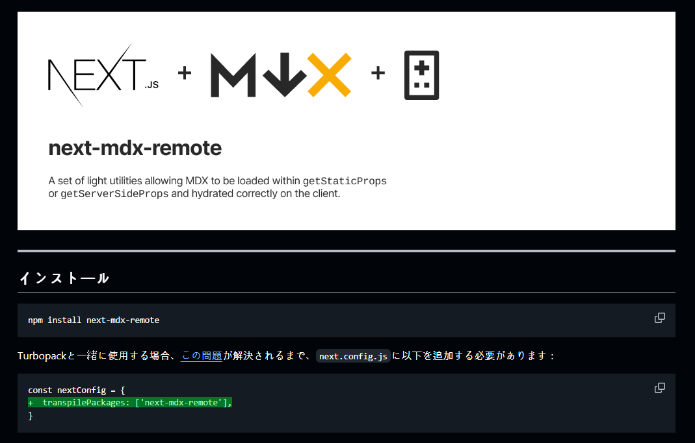

# next-mdx-remote

## はじめに

- 翻訳した README.md: [next-mdx-remote](https://github.com/foreverfl/next-mdx-remote/blob/main/README-ja.md)



今回、「next-mdx-remote」の公式 README を翻訳しました。この前、私のブログをリファクタリングしながら、このライブラリを使いました。

元々から私は私だけが使うために直接 CMS(Content Management System)で作りました。でも、最近は色んな公式ドキュメントを翻訳しながら、私のブログもこのように政敵サイトで作るといいかもしれないと思いました。そのため、私はプロジェクト内に MDX ファイルを集めたフォルダを作り、それを next-mdx-remote で読み込むようにしました

まず、MDX が見慣れない人がいるかもしれないので、MDX とは何かを説明します。

## MDX とは？

[MDX の公式ドキュメント](https://mdxjs.com/docs/what-is-mdx/)には以下のように書かれています。

> MDX では、マークダウンコンテンツ内で JSX を使用することができます。インタラクティブなチャートやアラートなどのコンポーネントをインポートして、コンテンツ内に埋め込むことができます。これにより、コンポーネントを使って長文のコンテンツを書くのがとても楽しくなります。🚀
>
> <cite>- MDX</cite>

簡単に言うと、MDX はマークダウンに JSX を使えるようにしたものです。これにより、マークダウンの中に React コンポーネントを埋め込むことができます。

```md
# Welcome to My Blog

This is a simple blog post written in **MDX**. You can use regular markdown syntax, like headings, lists, and code blocks.

- Item 1
- Item 2
- Item 3
```

既存のマークダウンでは上のように書くことができますが、MDX では以下のように書くことができます。

```mdx
# Title

This is a content block.

- Item 1
- Item 2
- Item 3

<Counter />

<MyCustomComponent message="Hello from MDX!" />
```

自分が定義した React コンポーネントを使うことができるので、より柔軟なコンテンツを作ることができます。プログラミングが上手い人には、自由度が高くなります。そしたら、MDX と next-mdx-remote はなんの関係があるんでしょうか？

## next-mdx-remote とは？

next-mdx-remote は名前で推測できるように、Next.js で MDX を使うためのライブラリです。私のブログは Next.js で作られているので、このライブラリを使うことにしました。

next-mdx-remote の README.md にあるコードを参考しながらコードを書くことはあんまり難しくなかったです。でも、next-mdx-remote を使うためには注意点があります。このライブラリを使う前にサーバーサイドレンダリング(SSR)について理解しておくことが重要です。公式ドキュメントにも書かれていますが、基本的な使用法は、クライアント側では `MDXRemote`を使い、サーバー側では `serialize` を使うことです。サーバー側からデータを持ち込んで、それをクライアント側に渡して`MDXRemote`で表示する仕組みです。

```jsx
import { serialize } from "next-mdx-remote/serialize";
import { MDXRemote } from "next-mdx-remote";

import Test from "../components/test";

const components = { Test };

export default function TestPage({ source }) {
  return (
    <div className="wrapper">
      <MDXRemote {...source} components={components} />
    </div>
  );
}

export async function getStaticProps() {
  // MDXテキスト - ローカルファイル、データベース、どこからでも取得可能
  const source = "Some **mdx** text, with a component <Test />";
  const mdxSource = await serialize(source);
  return { props: { source: mdxSource } };
}
```

このように`getStaticProps()`では、サーバー側で MDX テキストを取得し、`serialize` で変換してクライアント側に渡しています。そして、クライアント側にでは、`MDXRemote` で表示しています。ただ、これだけだったら、このドキュメントを詳しく見なかったでしょう。

問題は私が Next.js の App Router を使っていることでした。App Router の app パスは基本的にサーバーサイドとして扱われるので、`MDXRemote`を使うには無理があります。そして、この README.md にはこのように app パスでこのライブラリを利用する場合には、`next-mdx-remote/rsc`を使うように書かれています。ChatGPT に聞いてもずっとサーバーサイドで`MDXRemote`を使うコードを教えてくれてずっとエラーが発生して、イライラしました。結局、答えは公式ドキュメントに書かれていました。

## まとめ

next-mdx-remote の README.md でも、個人的な小さいサイトを作るために Next.js 見たいな重いフレームワークを避けることをお勧めしていますが、エンジニアとして最新の技術に惚れる情けない人間なのでどうしようもないです。

> データによると、すべての開発者ツールの使用例の 99%は、不必要に複雑な個人ブログを構築することです。冗談です。しかし、真剣に、個人や小規模ビジネス用のブログを構築しようとしている場合は、通常の HTML と CSS を使用することを検討してください。シンプルなブログを作成するために重いフルスタック JavaScript フレームワークを使用する必要は絶対にありません。数年後に更新を行うために戻ってきたとき、すべての依存関係に 10 回の破壊的なリリースがなかったことに感謝するでしょう。
>
> <cite>- next-mdx-remote</cite>

要約すると、next-mdx-remote を使う時には、サーバーサイドとクライアントサイドの違いを理解しておくことが重要です。これを理解しないと、ずっとエラーに悩まされることになります。Next.js で MDX を使おうとする人には、この文が役に立つといいと思います。長い投稿を読んでくれてありがとうございました。次には、もっと良い投稿でお尋ねします。
